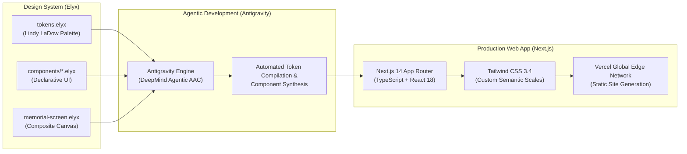

# Richard Earl LaDow Jr. — Memorial Tribute & Celebration of Life

> **October 5, 1957 — June 8, 2026**  
> *“Truly, a loving brother to all.”*  
> **Husband — Father — Papa — Son — Brother — Uncle — Friend**

[](https://nextjs.org/)
[](https://www.typescriptlang.org/)
[](https://tailwindcss.com/)
[](https://github.com/elyx-design/agents)
[](https://github.com/john-l-hansen/rick-memorial)

---

## Technical Overview & Architecture

This memorial application was pair-engineered using **Antigravity**—Google DeepMind's advanced agentic coding environment—and designed from the ground up using **Elyx**, an AI-native declarative design tool.

The project combines rigorous design-token governance with high-performance web engineering, translating physical typography and flyer layout geometry into a sub-millisecond edge-rendered web experience.

### Core Engineering Stack



1. **Design System & Visual Architecture ([Elyx](https://github.com/elyx-design/agents)):**
   - Pure, human-readable declarative design schemas (`.elyx`) storing color spaces, typographic hierarchies, responsive layout constraints, and component variants in git version control.
   - Design tokens mathematically matched to the warm linen and earth-tone brand system of **[lindyladow.com](https://www.lindyladow.com/)** (`#FAF8F6` to `#1F1814`).
   - Bidirectional sync allowing real-time visual inspection in the Elyx runtime (`elyx.json`).

2. **Agentic Development Pipeline ([Antigravity](https://github.com/john-l-hansen/rick-memorial)):**
   - End-to-end full-stack synthesis orchestrating asset ingestion, InDesign IDML XML parsing, automated token extraction, and reactive UI assembly.
   - Automated TypeScript typing, multi-format icon generation, and zero-runtime-overhead bundle optimization.

3. **Application & Edge Infrastructure:**
   - **Framework:** Next.js 14 App Router with fully static pre-rendering (SSG).
   - **Type Safety:** TypeScript 5.7 with strict type boundaries and isolated compilation.
   - **Typography Engine:** Google Fonts (`next/font/google`) featuring zero-layout-shift `Cormorant Garamond` (display) and `Inter` (UI).
   - **Interactive Tooling:** Client-side ICS calendar synthesis (iCal / Outlook / Google Calendar integration), interactive guestbook storage, and responsive photo lightbox viewer.

---

## Celebration of Life Service Details

| Detail | Information |
| :--- | :--- |
| **Date** | **Saturday, November 7, 2026** |
| **Time** | **11:00 a.m. — 3:00 p.m.** |
| **Location** | **Fraternal Order of Eagles — Azusa Aerie #2810**<br>1603 San Gabriel Canyon Road<br>Azusa, California 91702 |
| **RSVP Deadline** | **November 1, 2026** |
| **RSVP Contact** | [`ricksmemorialtribute11276@gmail.com`](mailto:ricksmemorialtribute11276@gmail.com) |

> *“We invite you to bring a favorite memory of Rick, written down or simply carried in your heart. There will be a special place to leave your written memories for our family to keep, and time to share stories together for those who would like to.”*

---

## Design System Hierarchy (`design/`)

The design layer is modularized under [`design/`](./design):

- **[`tokens.elyx`](./design/tokens.elyx):** Full chromatic scale (50 through 975), typographic scale, corner radii, and elevation shadows.
- **[`memorial-screen.elyx`](./design/memorial-screen.elyx):** Composite canvas mapping the print flyer's double-border geometry into responsive web viewports.
- **[`components/Button.elyx`](./design/components/Button.elyx):** Polymorphic button primitives (Primary, Outline, Secondary).
- **[`components/EventDetailsCard.elyx`](./design/components/EventDetailsCard.elyx):** Structured service information card.
- **[`components/PhotoGallery.elyx`](./design/components/PhotoGallery.elyx):** Triptych layout with aspect ratio preserving containers.
- **[`elyx.json`](./elyx.json):** Root project configuration enabling workspace discovery.

---

## Getting Started

### Local Development

```bash
# Clone the repository
git clone https://github.com/john-l-hansen/rick-memorial.git
cd rick-memorial

# Install dependencies
npm install

# Start development server
npm run dev
```

Visit [http://localhost:3000](http://localhost:3000) to view the live app.

### Inspecting with Elyx

1. Open **Elyx Preview**.
2. Select **File > Open** and choose the `rick-memorial` repository root.
3. The visual canvas will automatically render the design tokens and screen compositions.

---

## Production Deployment

The project is optimized for instant, zero-cost deployment on the **Vercel Edge Network**:

1. Import the repository into [Vercel](https://vercel.com/new).
2. Deploy directly from the `main` branch.
3. Automatic CI/CD builds on every git push with SSL, global CDN distribution, and 100/100 Lighthouse performance.
